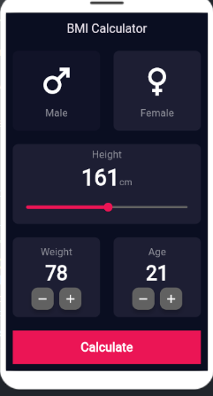
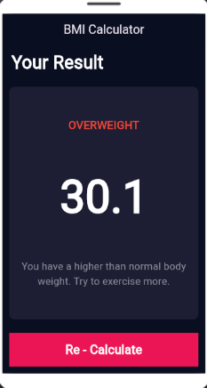

# BMI Calculator ⚖️


A simple, clean BMI (Body Mass Index) calculator built with Flutter. Enter your gender, height, weight, and age to instantly get your BMI score and a health category.

---

## 📱 Screenshots

<p align="center">
  
  &nbsp;&nbsp;
  
</p>

## 📱 Features

| Area | Description |
|---|---|
| **Gender Selection** | Choose Male or Female |
| **Height Slider** | Adjust height (cm) with a smooth slider |
| **Weight & Age Steppers** | Increment/decrement weight (kg) and age |
| **BMI Result** | Calculates BMI score and shows a category (e.g. Overweight, Normal) |
| **Health Tip** | Short guidance message based on the result |
| **Re-Calculate** | Reset and try again with new values |

## 🛠️ Tech Stack

| Category | Technology |
|---|---|
| Framework | Flutter |
| Language | Dart |
| Built with | [FlutLab](https://flutlab.io) — Flutter Online IDE |

## Getting Started

```bash
# Clone the repository
git clone https://github.com/22ousefmostafa/bmii.git
cd bmii

# Install dependencies
flutter pub get

# Run the app
flutter run
```

## Author

Built by [Youssef Mostafa](https://github.com/22ousefmostafa).

## License

This project is currently unlicensed.
